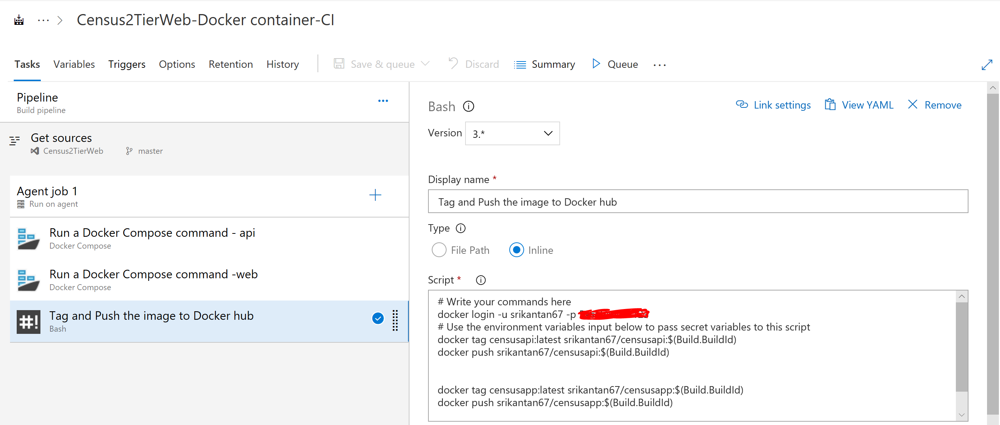
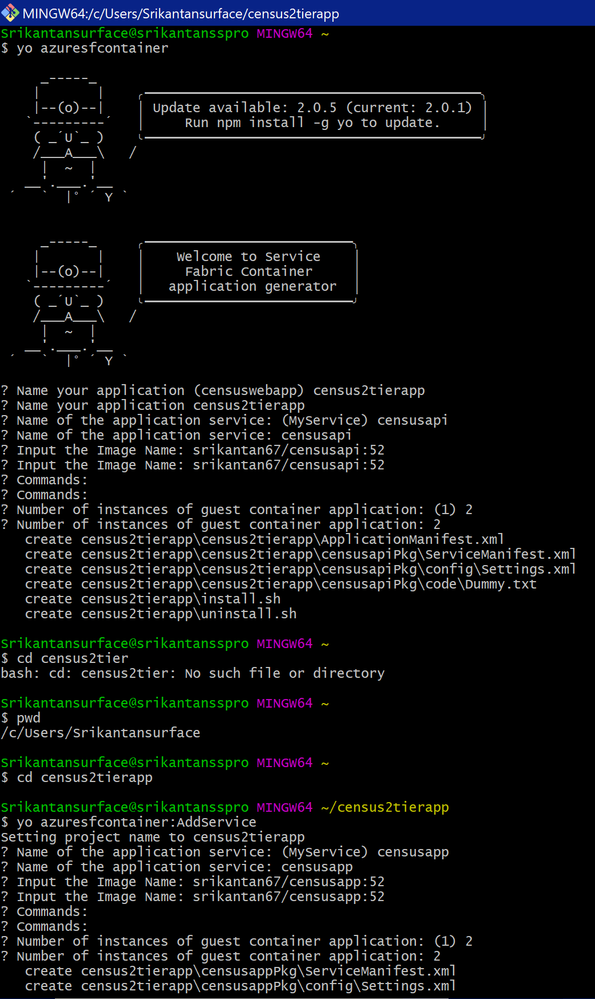
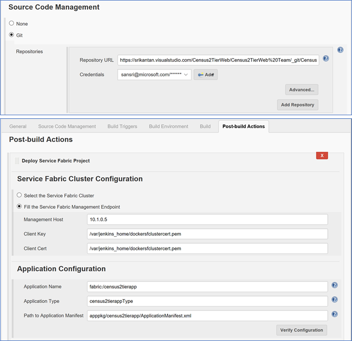
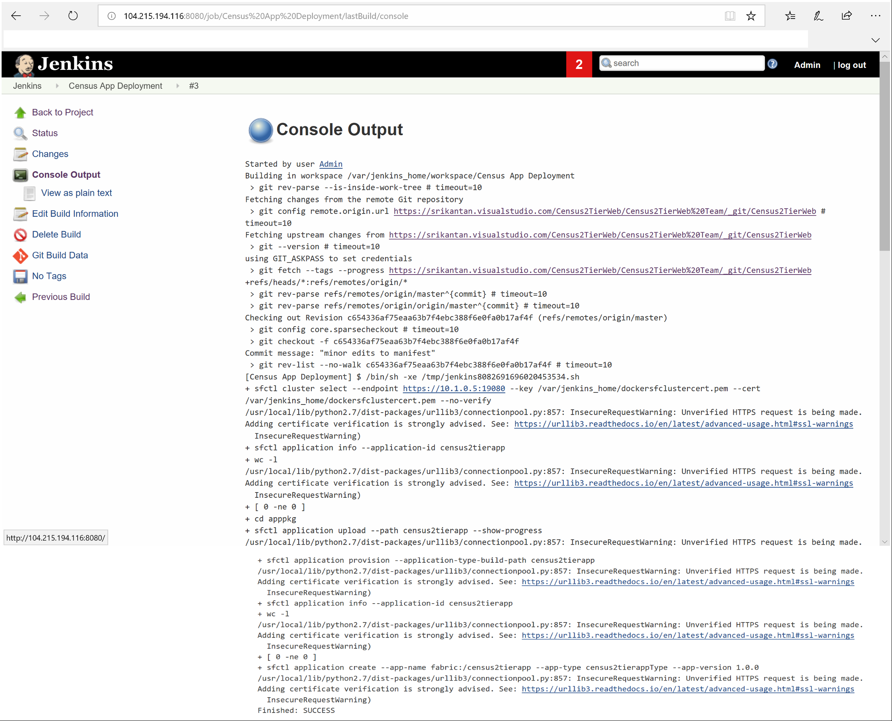

# Building and deploying highly available and resilient applications
A sample application that showcases how highly available and resilient services can be deployed to Azure. can be used to deploy highly available and reliable services. Refer to it in the context of the article published in the MSDN Magazine <to be added later>, that describes the use case and the architecture of the Solution.

## Developing the Application
There are two ASP.NET 2.0 Core Applications, one an Mvc Project **censusapp.sln** and the other, a Web API Project **censusapi.sln**. The Mvc project accepts user input and calls the Web API to store the data in Azure Cosmos DB. The applications are packaged using Docker containers for Linux using the built-in features in Visual Studio 2017. The source files, associated Dockerfile and docker-compose files of these Projects are available in this Repository. Minor edits were done to the docker-compose files of the two projects to add port mapping between the Node and container.

### About the Web API Project
The Application is deployed to two Azure regions (US East 2 and Southeast Asia). The Web API Project leverages the Multi-region write capability in Azure Cosmos DB to write data into a Collection local to that region. The Web API deployed to East US 2 region adds the Cosmos DB endpoint in this region as priority 1, and that in Southeast Asia as priority 2. This ensures that in the event of an issue connecting to the local collection, the SDK fails over the connection to Southeast Asia, preventing Application downtime. The snippet below shows how Multi-region write is enabled and how multiple connection endpoints are added.
~~~
ConnectionPolicy connectionPolicy = new ConnectionPolicy
{
    UseMultipleWriteLocations = true,
};
connectionPolicy.PreferredLocations.Add(LocationNames.EastUS2);
connectionPolicy.PreferredLocations.Add(LocationNames.SoutheastAsia);
~~~
The API takes minimal data from the user and generates fictitious data for the remaining attributes, using the Bogus Nuget Package.

## Source control and CI pipeline
The Source files from the two Projects are checked into a Git Repository in Azure Devops Service. A Continuous integration Pipeline uses the built-in activities to run docker-compose. This triggers a build of the Projects and generate the Container images for the Mvc and Web API Projects. The container images are tagged & suffixed with the CI Build Run Id, and pushed to the Docker Hub registry.

The steps above are repeated after making code changes to the Web API Project. The order of priority of the Cosmos DB connection endpoints are modified for deployment to Azure Region in Southeast Asia. The container image for the Mvc Project would be the same in both the regions.

## Packaging the Application for deployment to Service Fabric
The Yeoman tool creates an Application and adds two Service types, each representing the Mvc and Web API applications. At the prompt, provide the names of the container images uploaded to Docker Hub and the number of instances of containers of each Service type to deploy in Service Fabric. See below:

Application and Service Manifest xml files generated after this step need some additional configurations. (The manifest files are available in this Repo)

### Application Manifest
The Service DNS Name for the Web API Service needs to be added as shown on the snippet below, so that it is registered with the Service Fabric DNS Service. This is required by the Mvc App when it connects to the API Service in the Cluster. This DNS Name should match that in the appsettings.json file of the Mvc Project.
~~~
<DefaultServices>
    <Service Name="censusapi" ServiceDnsName="sfcensusapi">
      <StatelessService ServiceTypeName="censusapiType" InstanceCount="2" >
        <SingletonPartition/>
      </StatelessService>
    </Service>
    <Service Name="censusapp">
      <StatelessService ServiceTypeName="censusappType" InstanceCount="2">
        <SingletonPartition/>
      </StatelessService>
    </Service>
</DefaultServices>
~~~

### Service Manifests
The Service Fabric cluster deployed here contains 2 Node types, a Primary Node type that hosts only the Service Fabric platform services, and the other (secondary)that runs the Mvc and Web API Container images. In the manifest files of each Service, a placement constraint needs to be added using the Node Type Name of the Secondary cluster, to add the container images to this Node type alone. See the snippet below
~~~
<ServiceTypes>
      <StatelessServiceType ServiceTypeName="censusappType" UseImplicitHost="true">
		    <PlacementConstraints>(NodeTypeName==nt-sfazvm0)</PlacementConstraints>
   </StatelessServiceType>
</ServiceTypes>
~~~

### Provisioning the Service Fabric cluster

Use the ARM Template **SF-Std-ELB-ZonalDeployment.json** to deploy the cluster to Azure. Refer to the accompanying MSDN Magazine for guidance in completing the pre-requisites to run the ARM Template.
This step creates 2 Service Fabric clusters, each in a separate Azure Availability Zone in one Region (US East 2). A Standard SKU Load Balancer balances user requests across these two clusters, in an Active-Active configuration. Run the Template again to deploy the cluster to the second region, i.e. Southeast Asia.
Ensure the Node Type name for the secondary cluster in the ARM Template matches with that in the Placement constraint in the Service Manifests.

### Deploying the application to Service Fabric using Jenkins

The ARM Template deploys the cluster inside a VNet. Hence the Management endpoints used to deploy the application cannot be accessed from the internet, using Azure DevOps. A container image of Jenkins that has the Service Fabric add-on installed, is deployed into a Jumpbox VM in the same VNet as the Cluster.

**Note: Azure DevOps Server 2019 can be deployed inside a Jumpbox VM to deploy the Application to the Service Fabric cluster inside the VNet. This can be an alternative to using Jenkins**

Refer to the steps described in the article [here](https://docs.microsoft.com/en-us/azure/service-fabric/service-fabric-cicd-your-linux-applications-with-jenkins#configure-deployment-using-azure-credentials) to use the Addin and deploy the Application to the cluster.

Broadly the steps performed were:

Note: For simplicity, a self signed certificate is used here. For Production deployments use Azure AD based authentication to perform the steps.

1) Install Jenkins in the Jumpbox VM
//Pull the Docker images into the Jumpbox Linux VM

docker pull rapatchi/jenkins:latest

//Run the Docker container for Jenkins

docker run -itd -p 8080:8080 rapatchi/jenkins:latest

//Get the Jenkins Admin password for the Container instance

cat /var/jenkins_home/secrets/initialAdminPassword

// Generate and Copy the Admin client certificate to the Jumpbox VM from the local Windows computer 
// Use a tool like Winscp to copy the certificate file

//In the VM, copy the certificate to the Jenkins Home directory in the container

docker cp clustercert.pem [first-four-digits-of-container-ID] : /var/jenkins_home

2) Configure the Addin in Jenkins& deploy the Application
Launch Jenkins in the browser, install the default add-ins, add an Admin user.
Perform the steps described in the link shared above. and configure the Addin by pointing it to the Service Fabric cluster created earlier.

Trigger a Jenkins Build Job manually. The post trigger action pulls the Service Fabric Application packages (generated using Yeoman in the steps above) and deploys it to the cluster.
See the sample output from this run below.

Repeat the steps for deployment to the second region, i.e. Southeast Asia

The remaining steps to be performed are covered in the MSDN magazine article
